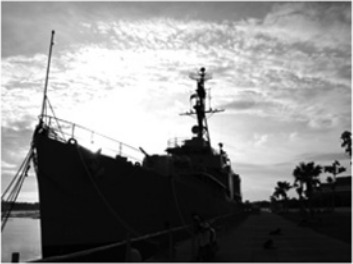
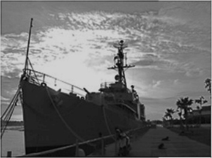
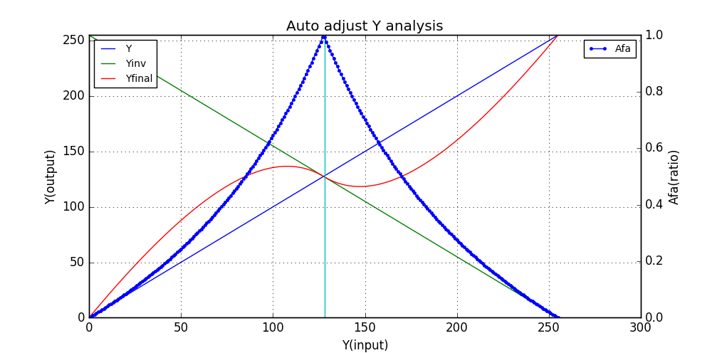

# HDR methods

## What i did?

I implemented ***2015 High-performance high dynamic range image generation by inverted local patterns*** But, this version do not include **AGC** which is in the following literature **2011_Low-complexity camera digital signal imaging for videodocument projection system**.

### Result

1. input image **src.jpg**

2. output image **res.jpg**

### By the way

As you see, in the source code. I also code a method which is used to auto adjust the bright(Light) of input image. The idea is very simple:

1. When x in [0,127], then Y in [0,127], Yinv in [255,128], and Y < Yinv; 
2. When x in[128,255],then Y in [128,255], Yinv in [127,0], and Y > Yinv;
3. The formula of Yfinal is as following:
    * Yfinal[i] = (1-afa)*Y[i] + afa*Yinv[i]
    * afa = max(Y[i],Yinv[i])/min(Y[i],Yinv[i]), i in[0,255]

I analysis the formula of Yfinal by Python language with the help of numpy and matplotlib. 

	import numpy as np
	import matplotlib.pyplot as plt
	Y = list(range(256))
	Yinv = list(range(255,-1, -1))
	x = list(range(256))
	afaList = [1.0*min(m,n)/max(m,n) for (m,n) in zip(Y,Yinv)]
	yfinal = [(1-afa)*m+afa*n for (m,n,afa) in zip(Y,Yinv,afaList)]
	fig = plt.figure(figsize=(10,5), dpi=80)
	ax1 = fig.add_subplot(111)
	plt.title("Auto adjust Y analysis")
	ax1.set_xlim(0, 128)
	ax1.set_ylim(0, 255)
	ax1.plot(x, Y, label="Y")
	ax1.plot(x, Yinv, label="Yinv")
	ax1.plot(x, yfinal, label="Yfinal")
	# -----setting middle value-----
	middle = np.full((256,1),128)
	ax1.plot(list(middle),x)
    # ------------------------------
	ax1.set_ylabel("Y(output)")
	ax1.set_xlabel("Y(input)")
	ax1.legend(loc='upper left', prop={'size':10})
	ax1.grid(True)
	ax2 = ax1.twinx()
	ax2.set_ylabel("Afa(ratio)")
	# ax2.set_ylim(0,1)
	ax2.plot(x, afaList, marker='.', label="Afa")
	ax2.legend(loc='upper right', prop={'size':10})
	plt.show()

